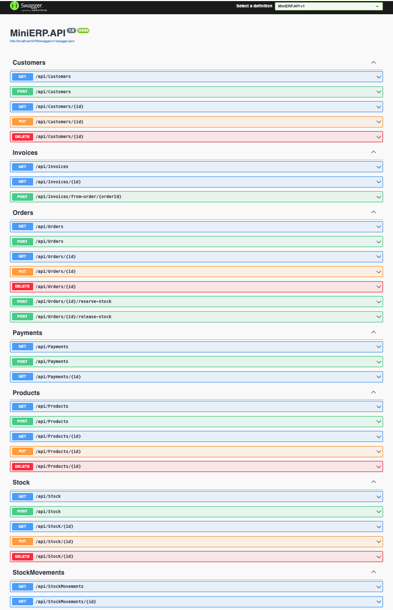
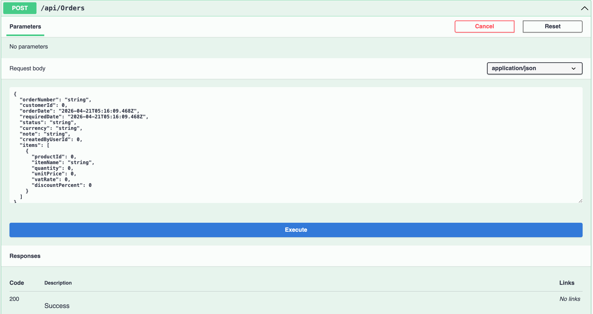
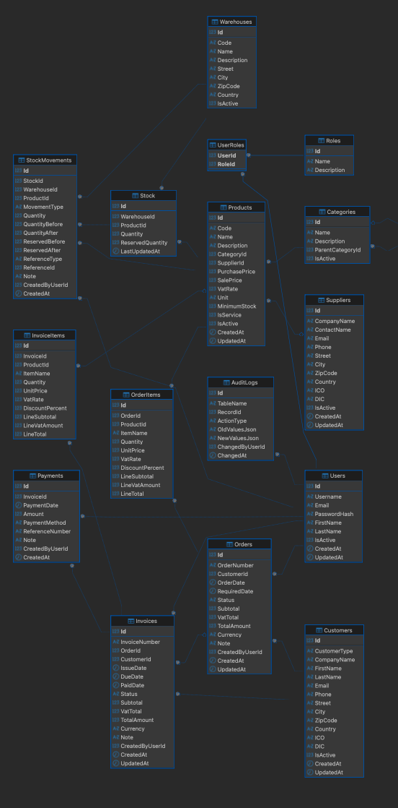

# MiniERP

Projekt MiniERP vznikl jako pokračování mého prvního pokusu o ERP aplikaci.  
Původně jsem ho měl postavený jako desktop aplikaci ve WinForms, kde jsem si zkoušel práci s daty, CRUD operace a základní logiku.

Postupně mi ale začalo docházet, že všechno mám moc svázané s UI a jakmile jsem chtěl něco rozšířit, začínalo to být nepřehledné.

Proto jsem se rozhodl začít znovu – tentokrát jako backend.

---

## Použité technologie 

- .NET 8 / ASP.NET Core Web API
- Entity Framework Core
- SQL Server (Docker)
- ASP.NET Identity
- JWT (Bearer autentizace)
- Swagger (OpenAPI)

---
##  Co projekt řeší                                     (aktuálně k verzi 1.2.57)

Projekt simuluje základní procesy, se kterými jsem se setkal v praxi:

- CRUD operace pro zákazníky, produkty, uživatele  
- práce se skladem a pohyby zásob  
- správa objednávek a jejich položek  
- Order-to-Cash flow (návaznost objednávky, skladu, fakturace a plateb)
- reporting  
- autentizace pomocí ASP.NET Identity  

Cílem nebylo vytvořit hotový ERP systém na zakázku, ale pochopit, jak tyhle části fungují dohromady.
---

## Architektura projektu

Projekt je rozdělený do několika vrstev, aby aplikační logika nebyla přímo navázaná na controller ani databázi

- **Controllers** – přijímají HTTP požadavky, volají příslušné služby a vrací odpověď přes API  
- **Services / Interfaces** – obsahují aplikační logiku; rozhraní oddělují kontrakt od konkrétní implementace  
- **DTOs** – slouží pro přenos dat mezi API a klientem, aby se ven neposílaly přímo databázové entity  
- **Validators** – kontrolují vstupní data pomocí FluentValidation ještě před zpracováním v business logice  
- **Entities** – reprezentují databázové tabulky a jsou mapované přes Entity Framework Core  
- **Data / ApplicationDbContext** – propojuje entity s databází a nastavuje základní mapování modelu 
- **Seed** – připravuje základní Identity data, například výchozí role a admin účet  
- **SQL scripts** – obsahují databázový základ, tabulky, vazby a stored procedures

- Databáze u mě není jen úložiště dat. Snažil jsem se řešit i to, aby dotazy dávaly smysl z pohledu výkonu (indexy na vazby) a aby kritické operace probíhaly spolehlivě (transakce ve stored procedures).
- Kritická logika (např. sklad, fakturace) je částečně přesunuta do SQL stored procedures, aby byla zajištěna konzistence dat na úrovni databáze.

---

## Funkcionalita

### Základní moduly
- zákazníci – evidence a CRUD operace
- produkty – evidence produktů a základních cen
- sklad – stav zásob a skladové pohyby
- objednávky – hlavička objednávky a položky
- faktury – faktura vytvořená z objednávky a její položky
- platby – evidence plateb k fakturám

### Order-to-Cash flow
Projekt obsahuje základní tok od objednávky po zaplacení:

- vytvoření objednávky
- rezervace skladových zásob
- vytvoření faktury z objednávky
- registrace platby
- změna stavů objednávky a faktury

### Reporting
Reporty jsou řešené přes SQL stored procedures:

- souhrn prodejů za období
- přehled neuhrazených faktur
- prodeje podle zákazníků
- nejprodávanější produkty
- skladová upozornění

### Autentizace a bezpečnost
- přihlášení přes ASP.NET Identity
- JWT autentizace
- refresh tokeny včetně rotation mechanismu
- logout přes zneplatnění refresh tokenu
- role-based access control pro role Admin, Manager a User

### Audit a security reporting
- audit přihlášení, refresh tokenů a logoutu
- přehled neúspěšných přihlášení
- bezpečnostní audit konkrétního uživatele
- zneplatnění refresh tokenů uživatele
- údržba expirovaných refresh tokenů

---

## Spuštění projektu

1. Spustit SQL Server (např. přes Docker)
2. Vytvořit databázi pomocí SQL scriptu:
3. Upravit connection string v "appsettings.json"  
3. Spustit API
4. Otevřít swagger: "https://localhost:xxxx/swagger"

# Swagger API Overview

## Core Modules 

## Post Order (example)

## SQL Schéma kterého se držíme 

## Technické poznámky a další rozvoj

Projekt teď řeší hlavně funkční část, ale při práci jsem narazil na věci, které dávají smysl řešit dál:

- výkon databáze (indexy, optimalizace dotazů)
- práce se souběžnými požadavky (hlavně sklad)
- sjednocení chyb napříč API
- rozšíření logování
- archivace starších dat a logů
- lepší správa warehouse (více skladů)
- rozšíření reporting modulu

Beru to jako další krok, kam projekt posunout.

